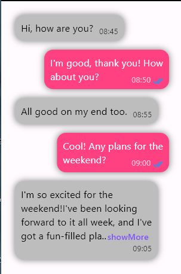

# Chat message Timestamped

Flutter package write with RenderObject for writting chat messages with timestamps and sending status icons.

## Preview

here you have all the case possible

- if sentAt fits on last line
- if sentAt does not fit on last line
- senAt with sending status icon
- message with max lines

checkout the example table to see complete implementation



## Getting started

add chat_message_timestamp in your flutter pubspec.yaml file

```dart
dependencies:
  chat_message_timestamp: //latest verison
```

import the package

```dart
import 'package:chat_message_timestamp/chat_message_timestamp.dart';
```

## Usage

use any shape you want such container ,card or customPainter then add it some padding  and that's it. Simple right

```dart
Container(
    color: Colors.blue,
    padding: const EdgeInsets.all(15.0),
    child: TimestampedChatMessage(
        text:'your message here',
        sentAt:'your timestamp',
),
),
```

You have a litte helper extension on DateTime for formatting DateTime instance in this package named *formattedTimeHm* that you can use .

```dart
TimestampedChatMessage(
        text:'your message here',
        sentAt: DateTime.now().formattedTimeHm,// this will return a string of formatted date hm. ex: 13:06 

),
```

checkout the example tab to see a complete implementation of TimestampedChatMessage

## Attributes

here are the attributes of TimestampedChatMessage

`text`: the text of your message. This is a required String\
`sentAt`: the timestamp of your message. This is a required String\
`style`: this is the style of your message text. This is an optional TextStyle\
`sentAtStyle`: this is the style of your timestamp text. This is an optional TextStyle\
`sendingStatusIcon`: this is the icon the may want to add to your bubble. This is an optional Icon\
`maxLines`: you can set the maximum lines of your message. Notice that the maxline number will be added each time you tapped on the 'showMore' textbutton it's not automaccally expanded the hole message but just add the amout of line maxLines specify. This is an optional Interger\
`delimiter`: the delimiter string if the message have to show 'showMore' textbutton. By default it is three dots but can assign it to whatever you want. This is an optional String\
`showMoreText`: the text of showMore if maxlines is specified et get reached. By default it is 'showMore'. This is an optional String\
`showMoreTextStyle`: this is the style of your showMore text. This is an optional TextStyle

## Notice

The package does not automacally detect links yet and does not allow you to put clickable string either but it planned to be added in the next upgrade of the package.

## Contribution

Contributions are welcome! Before submitting a Pull Request, please refrain from introducing additional dependencies.
